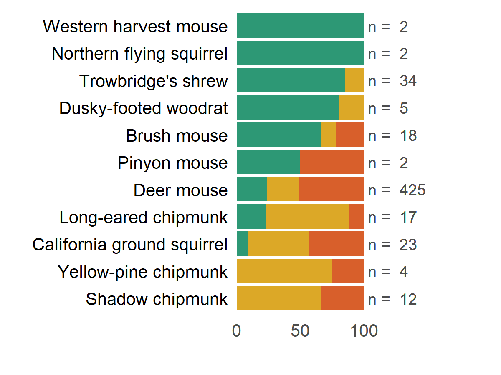

UCSB Young Lab R Graph Gallery
================

Browse through some figures made by members of the [Young
Lab](https://young-lab.eemb.ucsb.edu/) at UC Santa Barbara\! Click on a
figure to navigate to the source code. To contribute figures/code, read
the [contribution
directions](https://github.com/ucsbyounglab/figure-inspiration/blob/master/contributing.md).

  - [General](#general)
  - [Community analysis](#community-analysis)
  - [Model output](#model-output)
  - [Spatial](#spatial)

-----

### General

*Awaiting figures\!*

-----

### Community analysis

##### Habitat preference (Proportional abundance by habitat type)

-----

### Model output

*Awaiting figures\!*

-----

### Spatial

*Awaiting figures\!*

-----

#### *Additional resources*

  - [R graph catalog](http://shiny.stat.ubc.ca/r-graph-catalog/)
  - [The R graph gallery](http://www.r-graph-gallery.com/)
  - [R graph gallery](http://rgraphgallery.blogspot.com/)
  - [Cookbook for R: Graphs](http://www.cookbook-r.com/Graphs/)
  - [A compendium of clean graphs in
    R](http://shinyapps.org/apps/RGraphCompendium/index.php)
  - [Graphical data analysis with R](http://www.gradaanwr.net/)

*Repository structure modified from
[PJordano-Lab/R-figures](https://github.com/PJordano-Lab/R-figures).*
